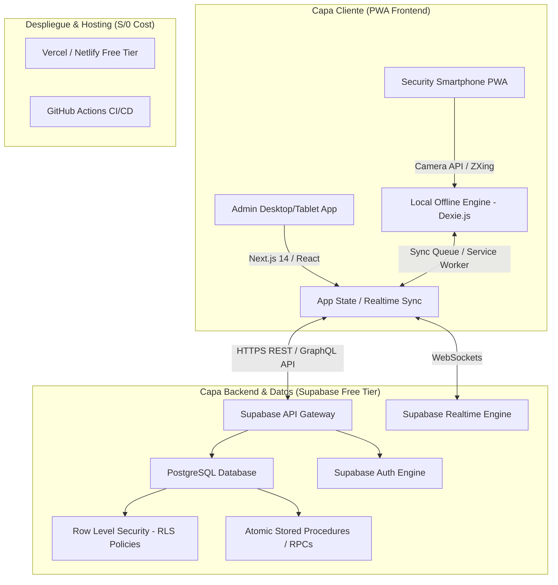
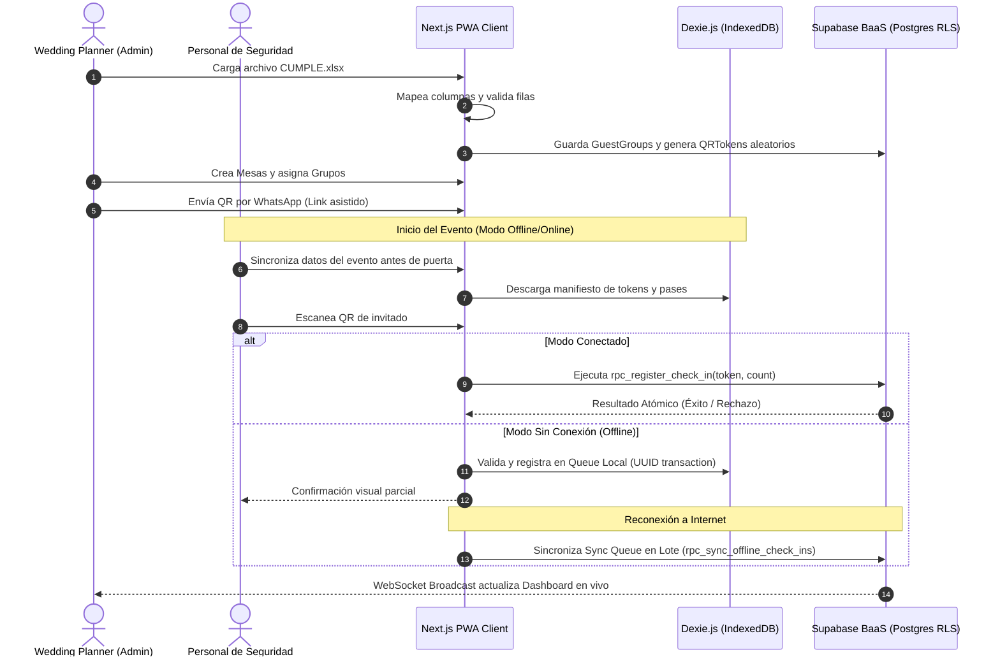
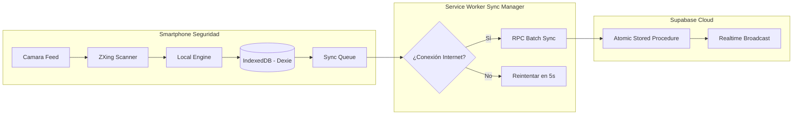

# ARCHITECTURE.md - PLATAFORMA SaaS DE CONTROL DE EVENTOS

## 1. Visión General de la Arquitectura

La **Plataforma SaaS de Control de Eventos** está diseñada como una arquitectura moderna, reactiva y tolerante a fallos de conectividad, construida sobre el patrón **PWA Offline-First + Backend As A Service (BaaS) Multi-tenant**.

El sistema atiende dos perfiles de uso claramente diferenciados:
1. **Administración / Wedding Planners (Desktop & Tablet)**: Gestión masiva de invitados, importación de Excel, diseño y asignación visual de mesas, envío de QR por WhatsApp asistido, cortes de catering y reportes ejecutivos.
2. **Personal de Seguridad / Recepción (Smartphones)**: Interfaz ultrasimplificada de alto rendimiento para escaneo acelerado de códigos QR, validación atómica de pases y registro parcial/completo en tiempo real (incluso en condiciones de nula o baja conectividad).



---

## 2. Stack Tecnológico Seleccionado y Justificación

| Componente | Tecnología Seleccionada | Justificación Técnica | Costo Inicial |
| :--- | :--- | :--- | :--- |
| **Framework Frontend** | Next.js 14+ (App Router, TypeScript) | Renderizado híbrido (SSR/SSG para Landing Page, SPA/PWA para App Privada), SEO óptimo, arquitectura modular. | **S/ 0** |
| **Estilos & UI** | Tailwind CSS + Shadcn UI + Lucide Icons | Componentes accesibles, altamente responsive, diseño moderno SaaS, excelente rendimiento móvil. | **S/ 0** |
| **PWA & Storage Local** | Service Worker + Dexie.js (IndexedDB) | Permite funcionamiento 100% Offline-First del módulo de check-in y almacenamiento estructurado local. | **S/ 0** |
| **Escáner QR** | `@zxing/library` / `html5-qrcode` | Acceso directo a cámara móvil HTML5 sin plugins nativos, rápido procesamiento frame-by-frame. | **S/ 0** |
| **Backend & Base de Datos** | Supabase (PostgreSQL 15+) | BaaS relacional robusto con RLS nativo para multi-tenancy, WebSockets para tiempo real y RPCs transaccionales. | **S/ 0 (Free Tier)** |
| **Autenticación** | Supabase Auth | Manejo seguro de usuarios, sesiones JWT, recuperación de clave y soporte de RBAC sin reinventar auth. | **S/ 0 (Free Tier)** |
| **Procesamiento Excel** | `SheetJS (xlsx)` | Lectura/escritura client-side de archivos XLSX/CSV, mapeo interactivo de columnas sin servidor pesado. | **S/ 0** |
| **Generación PDF** | `@react-pdf/renderer` + `html2canvas` | Generación de reportes ejecutivos vectoriales y capturas de dashboards visuales directamente en cliente. | **S/ 0** |
| **Hosting & CDN** | Vercel Free Tier | Despliegue global instantáneo, HTTPS automático, integraciones CI/CD nativas desde GitHub. | **S/ 0** |

---

## 3. Diagramas de Componentes y Flujos de Datos

### 3.1 Flujo General del Negocio



---

## 4. Estrategia Multi-tenant y Aislamiento de Datos

Para cumplir de forma estricta con la **Separación Garantizada en Backend**, se aplica el patrón **Single Database with Tenant ID Discriminator Column (`workspace_id`) + Postgres Row Level Security (RLS)**.

### 4.1 Principios de Seguridad Multi-tenant:
1. **Identificación de Tenant**: Cada usuario autenticado está asociado a uno o más Workspaces mediante la tabla `workspace_members`.
2. **Contexto de Sesión JWT**: El `workspace_id` activo se valida en cada petición HTTP o RPC.
3. **Filtro RLS Obligatorio**: Todas las tablas de datos (`events`, `guest_groups`, `qr_tokens`, `tables`, `check_ins`, `cuts`) poseen políticas Postgres RLS que verifican:
   ```sql
   workspace_id IN (
       SELECT workspace_id FROM workspace_members WHERE user_id = auth.uid()
   )
   ```
4. **Imposibilidad de Acceso Cruzado (IDOR)**: Incluso si un usuario modifica la URL manualmente a `/events/uuid-de-otro-workspace`, la base de datos devolverá `0 rows` (HTTP 404 / 403 Access Denied).

---

## 5. Estrategia Offline y Sincronización Concurrente

El módulo de check-in es crítico para la operación del evento. Se implementa un modelo **Offline-First Resilience Architecture**:



### 5.1 Garantías de Concurrencia y Control Atómico de Pases:
* **Escenario de Conflicto de Concurrencia (Dos Operadores Escaneando Simultáneamente)**:
  - Cuando dos teléfonos escanean el mismo QR al mismo tiempo (ej. quedan 2 pases, Op A pide 2, Op B pide 2):
  - El backend ejecuta una función almacenada atómica `rpc_register_check_in` con bloqueo de fila (`SELECT ... FOR UPDATE`).
  - La transacción que entra en primer lugar (timestamp Postgres) consume los 2 pases de forma exitosa (`checked_in = 5/5`).
  - La segunda transacción detecta inmediatamente `(checked_in_actual + requested) > max_passes` y es **RECHAZADA**, devolviendo la alerta: `⚠️ CANTIDAD NO AUTORIZADA (Disponibles: 0, Intentados: 2)`.
* **Idempotencia de Sincronización Offline**:
  - Cada check-in offline genera un `check_in_id` único (UUIDv4) en el dispositivo.
  - Al sincronizar, la base de datos utiliza `ON CONFLICT (id) DO NOTHING` para evitar duplicar movimientos si la red falla a mitad del envío.

---

## 6. Estrategia de Seguridad de Códigos QR

Para prevenir ataques de falsificación, suplantación o scraping de datos personales:

1. **Cero Datos Sensibles en Payload**:
   - El código QR **NO** contiene nombres de personas, teléfonos, número de mesa ni cantidad de pases autorizados.
   - Contiene únicamente un token criptográfico aleatorio de alta entropía (256-bit UUID / Base64URL string).
   - Ejemplo de contenido del QR: `https://app.eventos.pe/q/tk_7f9a2b8e1c4d3e5f6a7b8c9d0e`
2. **Verificación Servidor-Cliente**:
   - El token solo cobra sentido cuando es consultado mediante la API autenticada del personal de seguridad asignado al evento.
3. **Revocación y Regeneración Instantánea**:
   - Si un QR es extraviado o compartido erróneamente, el administrador puede revocarlo con un clic. Se invalida el token activo y se genera uno totalmente nuevo.

---

## 7. Análisis de Costos y Free Tier (Objetivo S/ 0)

La arquitectura está diseñada para operar con **Costo S/ 0 de infraestructura inicial**:

| Servicio | Límite Free Tier | Consumo Estimado MVP | Estado |
| :--- | :--- | :--- | :--- |
| **Supabase Database** | 500 MB PostgreSQL storage | ~10-20 MB por cada 50 eventos con 500 invitados | **HOLGADO (S/ 0)** |
| **Supabase Auth** | 50,000 Usuarios Activos Mensuales (MAU) | < 500 Planners en etapa MVP | **HOLGADO (S/ 0)** |
| **Supabase Realtime** | 200 Conexiones Concurrentes | ~10-20 dispositivos por evento activo | **HOLGADO (S/ 0)** |
| **Vercel Web Hosting** | 100 GB Transferencia / 100k Function Execs | < 5 GB Transferencia mensual | **HOLGADO (S/ 0)** |
| **WhatsApp Messaging** | Modo Asistido (`wa.me` links) | Sin límite (usa aplicación cliente del usuario) | **GRATIS (S/ 0)** |

> **Regla de Escala**: Si la plataforma supera los 50,000 MAUs o 500 MB en base de datos, los ingresos por suscripciones pagadas (Planes Starter S/39, Pro S/79) cubrirán holgadamente los planes Pro de Supabase ($25/mes) y Vercel Pro ($20/mes).

---

## 8. Matriz de Riesgos Técnicos y Mitigación

| Riesgo Detectado | Nivel | Estrategia de Mitigación |
| :--- | :---: | :--- |
| **Lectura errónea/Incompatibilidad de cámaras en smartphones antiguos** | Medio | Implementar fallback de ingreso manual mediante código corto alternativo de 6 caracteres visible en la app del administrador. |
| **Estructuras caóticas en archivos Excel subidos por usuarios** | Alto | Implementar motor de mapeo interactivo de columnas (Step-by-step Wizard) con vista previa y validación estricta de tipos de datos. |
| **Pérdida de conectividad prolongada en locales subterráneos o alejados** | Alto | Descarga previa completa del manifiesto del evento en IndexedDB y sincronización diferida transparente al volver a zona con cobertura. |
| **Uso malintencionado de códigos QR compartidos a terceros** | Medio | Bloqueo automático del QR tan pronto alcanza la capacidad de pases autorizados (`ingresados >= pases`). |
| **Dependencia de APIs pagadas en futuras fases (ej. WhatsApp Official)** | Bajo | Mantener el envío asistido vía `wa.me` como función estándar sin costo y dejar WhatsApp Business API oficial como Add-on opcional facturable al cliente. |
