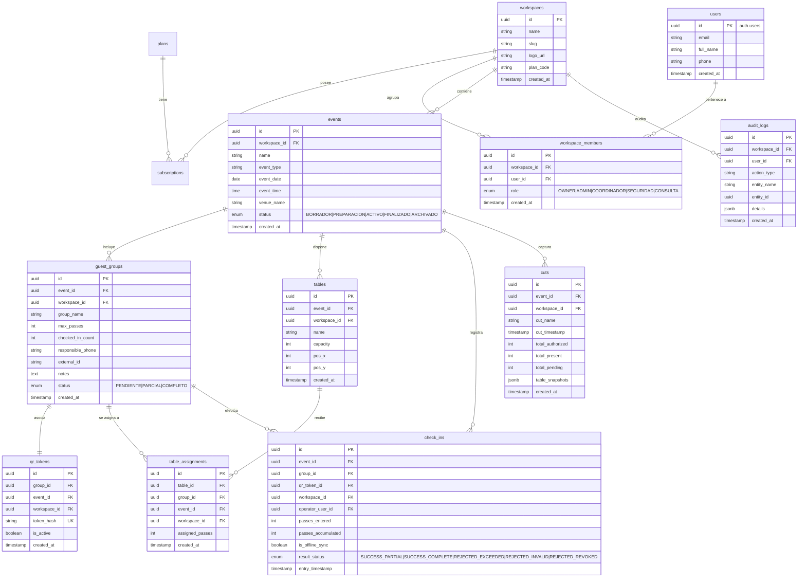

# DATABASE.md - ESQUEMA Y MODELO DE DATOS (POSTGRESQL / SUPABASE)

## 1. Diagrama Entidad-Relación (ERD)



---

## 2. Definición de Tablas y Esquemas DDL (PostgreSQL)

```sql
-- Habilitar extensión UUID
CREATE EXTENSION IF NOT EXISTS "uuid-ossp";

-- 1. WORKSPACES
CREATE TABLE workspaces (
    id UUID PRIMARY KEY DEFAULT uuid_generate_v4(),
    name VARCHAR(255) NOT NULL,
    slug VARCHAR(255) UNIQUE NOT NULL,
    logo_url TEXT,
    plan_code VARCHAR(50) NOT NULL DEFAULT 'FREE',
    created_at TIMESTAMPTZ DEFAULT NOW(),
    updated_at TIMESTAMPTZ DEFAULT NOW()
);

-- 2. WORKSPACE MEMBERS (Roles & RBAC)
CREATE TYPE user_role AS ENUM ('OWNER', 'ADMIN', 'COORDINADOR', 'SEGURIDAD', 'CONSULTA');

CREATE TABLE workspace_members (
    id UUID PRIMARY KEY DEFAULT uuid_generate_v4(),
    workspace_id UUID NOT NULL REFERENCES workspaces(id) ON DELETE CASCADE,
    user_id UUID NOT NULL REFERENCES auth.users(id) ON DELETE CASCADE,
    role user_role NOT NULL DEFAULT 'COORDINADOR',
    created_at TIMESTAMPTZ DEFAULT NOW(),
    UNIQUE(workspace_id, user_id)
);

-- 3. EVENTS
CREATE TYPE event_status AS ENUM ('BORRADOR', 'PREPARACION', 'ACTIVO', 'FINALIZADO', 'ARCHIVADO');

CREATE TABLE events (
    id UUID PRIMARY KEY DEFAULT uuid_generate_v4(),
    workspace_id UUID NOT NULL REFERENCES workspaces(id) ON DELETE CASCADE,
    name VARCHAR(255) NOT NULL,
    event_type VARCHAR(100) DEFAULT 'Boda',
    event_date DATE NOT NULL,
    event_time TIME,
    venue_name VARCHAR(255),
    status event_status NOT NULL DEFAULT 'BORRADOR',
    created_at TIMESTAMPTZ DEFAULT NOW(),
    updated_at TIMESTAMPTZ DEFAULT NOW()
);

-- 4. GUEST GROUPS
CREATE TYPE group_status AS ENUM ('PENDIENTE', 'PARCIAL', 'COMPLETO');

CREATE TABLE guest_groups (
    id UUID PRIMARY KEY DEFAULT uuid_generate_v4(),
    event_id UUID NOT NULL REFERENCES events(id) ON DELETE CASCADE,
    workspace_id UUID NOT NULL REFERENCES workspaces(id) ON DELETE CASCADE,
    group_name VARCHAR(255) NOT NULL,
    max_passes INT NOT NULL CHECK (max_passes > 0),
    checked_in_count INT NOT NULL DEFAULT 0 CHECK (checked_in_count >= 0),
    responsible_phone VARCHAR(50),
    external_id VARCHAR(100),
    notes TEXT,
    status group_status NOT NULL DEFAULT 'PENDIENTE',
    created_at TIMESTAMPTZ DEFAULT NOW(),
    updated_at TIMESTAMPTZ DEFAULT NOW()
);

-- 5. QR TOKENS
CREATE TABLE qr_tokens (
    id UUID PRIMARY KEY DEFAULT uuid_generate_v4(),
    group_id UUID UNIQUE NOT NULL REFERENCES guest_groups(id) ON DELETE CASCADE,
    event_id UUID NOT NULL REFERENCES events(id) ON DELETE CASCADE,
    workspace_id UUID NOT NULL REFERENCES workspaces(id) ON DELETE CASCADE,
    token_hash VARCHAR(255) UNIQUE NOT NULL,
    is_active BOOLEAN NOT NULL DEFAULT TRUE,
    created_at TIMESTAMPTZ DEFAULT NOW()
);

-- 6. TABLES (Plano Visual)
CREATE TABLE tables (
    id UUID PRIMARY KEY DEFAULT uuid_generate_v4(),
    event_id UUID NOT NULL REFERENCES events(id) ON DELETE CASCADE,
    workspace_id UUID NOT NULL REFERENCES workspaces(id) ON DELETE CASCADE,
    name VARCHAR(100) NOT NULL,
    capacity INT NOT NULL CHECK (capacity > 0),
    pos_x INT DEFAULT 0,
    pos_y INT DEFAULT 0,
    created_at TIMESTAMPTZ DEFAULT NOW()
);

-- 7. TABLE ASSIGNMENTS
CREATE TABLE table_assignments (
    id UUID PRIMARY KEY DEFAULT uuid_generate_v4(),
    table_id UUID NOT NULL REFERENCES tables(id) ON DELETE CASCADE,
    group_id UUID NOT NULL REFERENCES guest_groups(id) ON DELETE CASCADE,
    event_id UUID NOT NULL REFERENCES events(id) ON DELETE CASCADE,
    workspace_id UUID NOT NULL REFERENCES workspaces(id) ON DELETE CASCADE,
    assigned_passes INT NOT NULL CHECK (assigned_passes > 0),
    created_at TIMESTAMPTZ DEFAULT NOW(),
    UNIQUE(table_id, group_id)
);

-- 8. CHECK INS (Historial Atómico)
CREATE TYPE check_in_result AS ENUM (
    'SUCCESS_PARTIAL',
    'SUCCESS_COMPLETE',
    'REJECTED_EXCEEDED',
    'REJECTED_INVALID',
    'REJECTED_REVOKED'
);

CREATE TABLE check_ins (
    id UUID PRIMARY KEY DEFAULT uuid_generate_v4(),
    event_id UUID NOT NULL REFERENCES events(id) ON DELETE CASCADE,
    group_id UUID REFERENCES guest_groups(id) ON DELETE SET NULL,
    qr_token_id UUID REFERENCES qr_tokens(id) ON DELETE SET NULL,
    workspace_id UUID NOT NULL REFERENCES workspaces(id) ON DELETE CASCADE,
    operator_user_id UUID REFERENCES auth.users(id),
    passes_entered INT NOT NULL DEFAULT 0,
    passes_accumulated INT NOT NULL DEFAULT 0,
    is_offline_sync BOOLEAN NOT NULL DEFAULT FALSE,
    result_status check_in_result NOT NULL,
    entry_timestamp TIMESTAMPTZ DEFAULT NOW()
);

-- 9. CUTS (Fotografía Inmutable)
CREATE TABLE cuts (
    id UUID PRIMARY KEY DEFAULT uuid_generate_v4(),
    event_id UUID NOT NULL REFERENCES events(id) ON DELETE CASCADE,
    workspace_id UUID NOT NULL REFERENCES workspaces(id) ON DELETE CASCADE,
    cut_name VARCHAR(150) NOT NULL,
    cut_timestamp TIMESTAMPTZ DEFAULT NOW(),
    total_authorized INT NOT NULL,
    total_present INT NOT NULL,
    total_pending INT NOT NULL,
    table_snapshots JSONB NOT NULL,
    created_at TIMESTAMPTZ DEFAULT NOW()
);

-- 10. AUDIT LOGS
CREATE TABLE audit_logs (
    id UUID PRIMARY KEY DEFAULT uuid_generate_v4(),
    workspace_id UUID NOT NULL REFERENCES workspaces(id) ON DELETE CASCADE,
    user_id UUID REFERENCES auth.users(id),
    action_type VARCHAR(100) NOT NULL,
    entity_name VARCHAR(100) NOT NULL,
    entity_id UUID,
    details JSONB,
    created_at TIMESTAMPTZ DEFAULT NOW()
);
```

---

## 3. Procedimientos Almacenados Transaccionales (RPCs)

### 3.1 Escaneo y Check-in Atómico (`rpc_register_check_in`)

Garantiza que dos operadores escaneando simultáneamente jamás superen los pases autorizados.

```sql
CREATE OR REPLACE FUNCTION rpc_register_check_in(
    p_token VARCHAR(255),
    p_passes_requested INT,
    p_operator_id UUID,
    p_is_offline BOOLEAN DEFAULT FALSE,
    p_client_timestamp TIMESTAMPTZ DEFAULT NOW()
)
RETURNS JSONB
LANGUAGE plpgsql
SECURITY DEFINER
AS $$
DECLARE
    v_token_rec RECORD;
    v_group_rec RECORD;
    v_new_checked_in INT;
    v_new_status group_status;
    v_result_status check_in_result;
    v_check_in_id UUID;
BEGIN
    -- 1. Buscar Token y Validar existencia
    SELECT * INTO v_token_rec
    FROM qr_tokens
    WHERE token_hash = p_token;

    IF NOT FOUND THEN
        RETURN jsonb_build_object(
            'success', false,
            'reason', 'REJECTED_INVALID',
            'message', 'Código QR no válido'
        );
    END IF;

    IF NOT v_token_rec.is_active THEN
        RETURN jsonb_build_object(
            'success', false,
            'reason', 'REJECTED_REVOKED',
            'message', 'Código QR revocado por el administrador'
        );
    END IF;

    -- 2. Bloquear Fila del Grupo con FOR UPDATE (Evita Race Condition)
    SELECT * INTO v_group_rec
    FROM guest_groups
    WHERE id = v_token_rec.group_id
    FOR UPDATE;

    -- 3. Validar Sobrecupo
    IF (v_group_rec.checked_in_count + p_passes_requested) > v_group_rec.max_passes THEN
        -- Registrar intento fallido en auditoría de check-ins
        INSERT INTO check_ins (
            event_id, group_id, qr_token_id, workspace_id, operator_user_id,
            passes_entered, passes_accumulated, is_offline_sync, result_status, entry_timestamp
        ) VALUES (
            v_group_rec.event_id, v_group_rec.id, v_token_rec.id, v_group_rec.workspace_id, p_operator_id,
            p_passes_requested, v_group_rec.checked_in_count, p_is_offline, 'REJECTED_EXCEEDED', p_client_timestamp
        );

        RETURN jsonb_build_object(
            'success', false,
            'reason', 'REJECTED_EXCEEDED',
            'max_passes', v_group_rec.max_passes,
            'already_entered', v_group_rec.checked_in_count,
            'available', (v_group_rec.max_passes - v_group_rec.checked_in_count),
            'requested', p_passes_requested,
            'message', 'La cantidad solicitada supera los pases disponibles'
        );
    END IF;

    -- 4. Actualizar Estado Atómicamente
    v_new_checked_in := v_group_rec.checked_in_count + p_passes_requested;
    
    IF v_new_checked_in = v_group_rec.max_passes THEN
        v_new_status := 'COMPLETO';
        v_result_status := 'SUCCESS_COMPLETE';
    ELSE
        v_new_status := 'PARCIAL';
        v_result_status := 'SUCCESS_PARTIAL';
    END IF;

    UPDATE guest_groups
    SET checked_in_count = v_new_checked_in,
        status = v_new_status,
        updated_at = NOW()
    WHERE id = v_group_rec.id;

    -- 5. Registrar Check-In exitoso
    INSERT INTO check_ins (
        event_id, group_id, qr_token_id, workspace_id, operator_user_id,
        passes_entered, passes_accumulated, is_offline_sync, result_status, entry_timestamp
    ) VALUES (
        v_group_rec.event_id, v_group_rec.id, v_token_rec.id, v_group_rec.workspace_id, p_operator_id,
        p_passes_requested, v_new_checked_in, p_is_offline, v_result_status, p_client_timestamp
    ) RETURNING id INTO v_check_in_id;

    RETURN jsonb_build_object(
        'success', true,
        'check_in_id', v_check_in_id,
        'group_name', v_group_rec.group_name,
        'passes_entered', p_passes_requested,
        'passes_accumulated', v_new_checked_in,
        'max_passes', v_group_rec.max_passes,
        'status', v_new_status,
        'message', 'Ingreso registrado correctamente'
    );
END;
$$;
```

---

## 4. Políticas de Seguridad (Row Level Security - RLS)

```sql
-- Habilitar RLS en todas las tablas
ALTER TABLE workspaces ENABLE ROW LEVEL SECURITY;
ALTER TABLE workspace_members ENABLE ROW LEVEL SECURITY;
ALTER TABLE events ENABLE ROW LEVEL SECURITY;
ALTER TABLE guest_groups ENABLE ROW LEVEL SECURITY;
ALTER TABLE qr_tokens ENABLE ROW LEVEL SECURITY;
ALTER TABLE tables ENABLE ROW LEVEL SECURITY;
ALTER TABLE table_assignments ENABLE ROW LEVEL SECURITY;
ALTER TABLE check_ins ENABLE ROW LEVEL SECURITY;
ALTER TABLE cuts ENABLE ROW LEVEL SECURITY;

-- Helper SQL para verificar membresía de workspace
CREATE OR REPLACE FUNCTION public.current_user_has_workspace_access(target_workspace_id UUID)
RETURNS BOOLEAN AS $$
BEGIN
  RETURN EXISTS (
    SELECT 1 FROM workspace_members
    WHERE workspace_id = target_workspace_id
      AND user_id = auth.uid()
  );
END;
$$ LANGUAGE plpgsql SECURITY DEFINER;

-- Política de aislamiento para EVENTS
CREATE POLICY events_workspace_isolation ON events
    FOR ALL
    USING (public.current_user_has_workspace_access(workspace_id));

-- Política de aislamiento para GUEST_GROUPS
CREATE POLICY guest_groups_workspace_isolation ON guest_groups
    FOR ALL
    USING (public.current_user_has_workspace_access(workspace_id));
```

---

## 5. Índices de Rendimiento

```sql
CREATE INDEX idx_workspace_members_user ON workspace_members(user_id, workspace_id);
CREATE INDEX idx_events_workspace ON events(workspace_id, status);
CREATE INDEX idx_guest_groups_event ON guest_groups(event_id, status);
CREATE INDEX idx_qr_tokens_hash ON qr_tokens(token_hash) WHERE is_active = TRUE;
CREATE INDEX idx_check_ins_event ON check_ins(event_id, entry_timestamp);
CREATE INDEX idx_cuts_event ON cuts(event_id, cut_timestamp);
```
